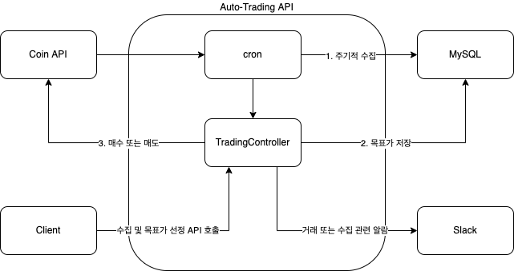

# Auto-Trading

> 24시간 열려있는 코인 시장에서 알고리즘을 통해 지속적으로 관찰하고 매수, 매도를 자동으로 하는 시스템이다.

### API

> 코인거래소는 여러 회사에서 운영하고 있고 코인 시세를 조회하거나 매수, 매도할 수 있는 API를 제공한다. API는 Bithumb, UPbit, Binance, Bybit 등에서 제공하고 있다. Binance와 Bybit은 선물거래가 가능하여 레버리지를 설정할 수 있다.

##### Bithumb

- 코인 자동 매매 시스템을 개발할 때 처음 사용해봤다. Python으로 개발 할때는 비교적 사용이 쉬웠지만 RestAPI를 통해 개발할 때는 비교적 자료가 잘 안되어있고 동작이 잘 안되어 사용하지 않을 것이다.
- Bithumb API: https://apidocs.bithumb.com/

##### UPbit

- 현재 시스템에 주로 사용할 거래소는 UPbit이다. Bithumb과 비교했을때 비교적 업데이트가 잘 되어있고 다양한 언어에서 사용할 수 있도록 가이드가 비교적 잘 되어있다.
- 업비트 개발자 센터: https://docs.upbit.com/

### 변동성 매매전략

> 변동성 매매 전략은 일정 수준의 범위를 돌파하는 강항 상승세를 돌파신호로 판단하고 상승 추세를 따라가며 일 단위로 매매하는 단기매매 전략이다.

##### 알고리즘

- 전날의 일봉 기준 range(전일 고가 - 전일 저가)를 계산한다.
- 당일 장중에 당일 시가 + range * k 를 넘게되면 매수하게 된다.
- 익일 시가기준으로 매도한다.

##### K 값

- K값은 노이즈 비율로 시장 상황이나 추세에 따라 실시간으로 변동한다.
- 일정기간 동안 가격이 일정한 방향으로 움직일때 노이즈를 적고 횡보하면 노이즈가 많다고 판단한다.
- K값이 높으면 비추세로 판단하여 진입시점을 높게 잡으며 K값이 낮으면 추세라고 판단하여 진입시점을 낮게잡는다.

### Architecture

> Framework: Spring Boot
>
> ORM: JPA
>
> Database: MySQL
>
> Test: Junit

- 매일 9시(한국시간)에 전날 모든 코인의 시가, 종가, 고가, 저가등을 수집하여 Database에 저장한다.
- 수집이 완료되면 수집된 내용을 바탕으로 당일 매매할 코인을 특정하고 목표가를 계산한다.
- 당일 10시부터 익일 9시까지 매초마다 계산된 목표가를 넘는지 관찰하게 된다.
- Client는 API를 통해 목표가를 다시 계산하거나 수집을 다시 시도할 수 있다.
- 매수 또는 매도를 하거나 수집중인 내용을 Slack Hook을 통해 메시지를 전송한다.

### Service 및 Repository

##### CoinMarketService

- Coin API를 통해 시세 조회 또는 매수, 매도를 할 수 있다.
- Upbit외에도 Binance, Bybit등 코인 시장에 따라 구현체를 갖도록 한다.

##### TradingAlgorithmService

- 목표가 산정하는 부분을 추상화 한다.
- 알고리즘에 따라 구현체를 정의할 수 있도록 한다.

##### DayCandleRepository

- 일봉을 생성, 조회, 수정, 삭제한다.

##### MarketOrderRepository

- 계산된 목표가를 생성, 조회, 수정, 삭제한다.

